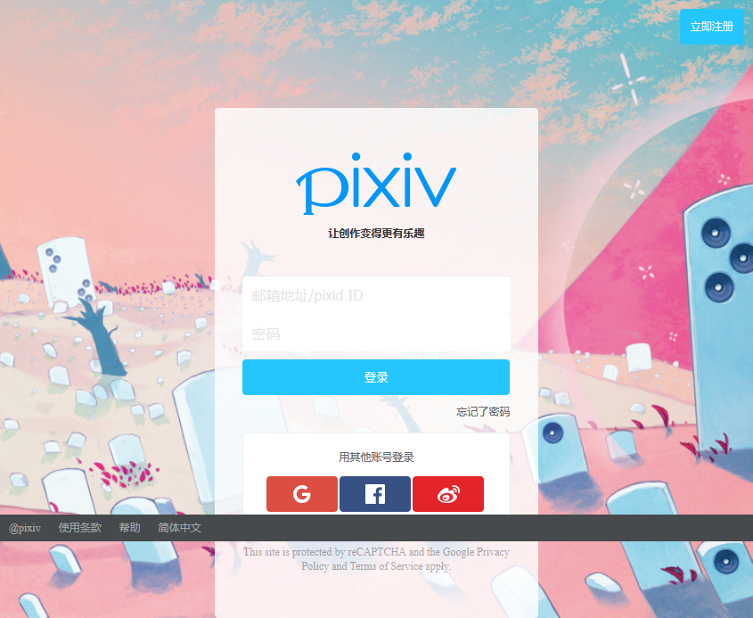

# 项目介绍
使用webpack + babel + zepto ，专门用于打造的h5页面的壳工程

# 技术简介

## 1. 自适应

使用postcss 以rem /vw 为单位，在375px像素的设备上设计对应各大尺寸设备的页面

## 2. webpack-dev-server 
多入口配置

## 3. 动态css语言
使用scss 

## 4. 多页应用

### 配置多页server
在dev-server中指定输出目录 
```js
devServer: {
  port: '3000',
  contentBase: path.join(__dirname, "dist"),
  index: 'index.html'
}
```

在htmlWebpackPlugin的配置中，可以配置多个页面
```js
new htmlWebpackPlugin({
  template: path.join(__dirname, './src/index.html'),
  //指定模板对象 将来根据指定的页面路径 去生成内存中的页面
  filename: 'index.html'
}),
new htmlWebpackPlugin({
  template: path.join(__dirname, './src/test.html'),
  //指定模板对象 将来根据指定的页面路径 去生成内存中的页面
  filename: 'test.html'
})
```
运行dev-server ，最后浏览器访问 http://localhost:3000/test.html

### 多个入口对应多个页面 
试想，不可能每个html文件都对应一个index.js，不然不同页面操作DOM不是乱套了吗? 

所以多个JS文件只能是一一对应的关系

index.js -> index.html 
test.js -> test.html

这样做 
```js
entry: {
  index : './src/js/index.js',
  test : './src/js/test.js'
},
plugins : [
  new htmlWebpackPlugin({
    template: path.join(__dirname, './src/test.html'),
    // 指定模板对象 将来根据指定的页面路径 去生成内存中的页面
    filename: 'test.html',
    // 指定入口js文件
    chunks : ['test']
  })
]
```

# 实例 : 模仿p站页面

